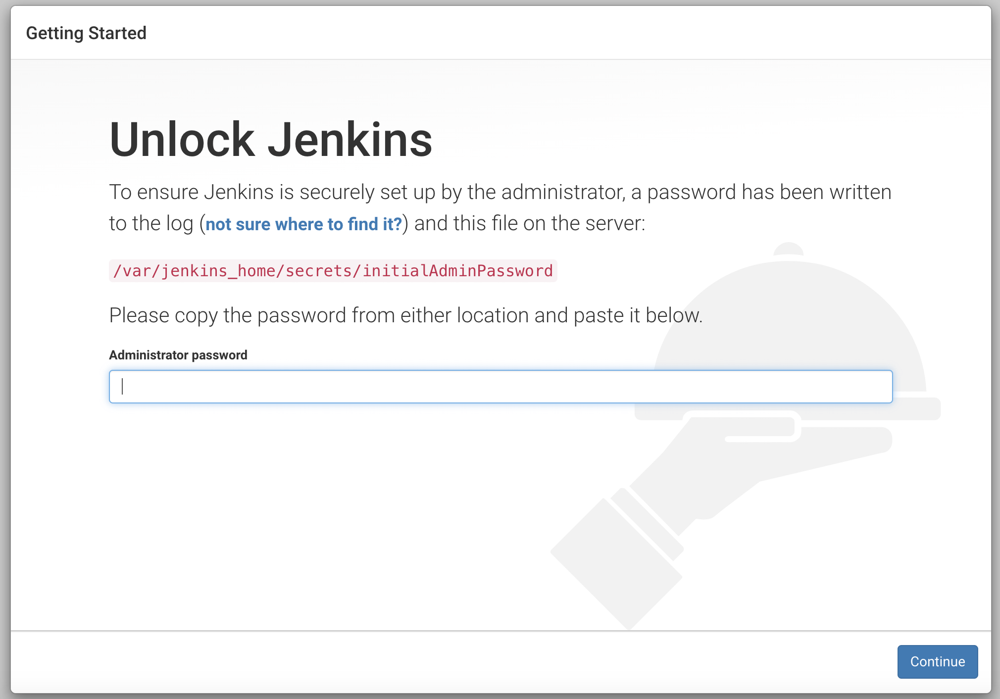
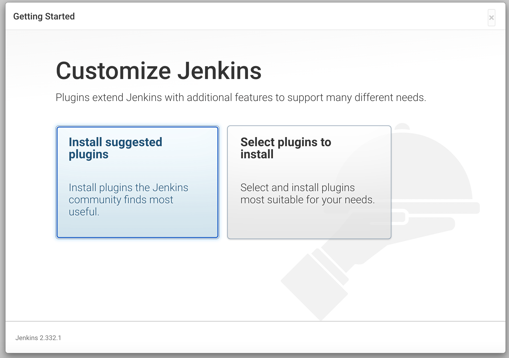
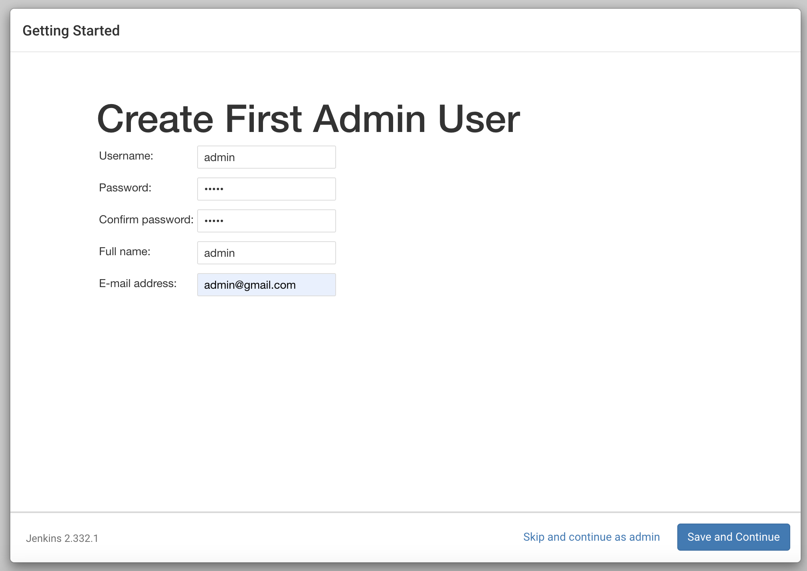
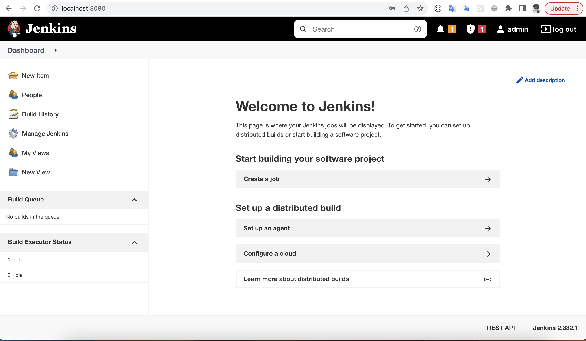

## Start and setup Jenkins
### Install Jenkins with command line
1. Run brew install Jenkins
    ```sh
    brew install jenkins-lts
    ```
2. and wait until you see something like this in terminal. Copy the password.​
    ```sh
    Jenkins initial setup is required. An admin user has been created and a password    generated.
    Please use the following password to proceed to installation:

    cc3839a0db7b49d2ba606d69c15e3740 // copy this for jenkins installation

    This may also be found at: /var/jenkins_home/secrets/initialAdminPassword
    ```
3. Open a browser on <b>http://localhost:8080</b>​ and place your password from Jenkins console log into Administrator password and press continue.

- Choose "suggested plugins"​​

- Create your admin user​

- Login Jenkins with your admin and you'll land to jenkins page

