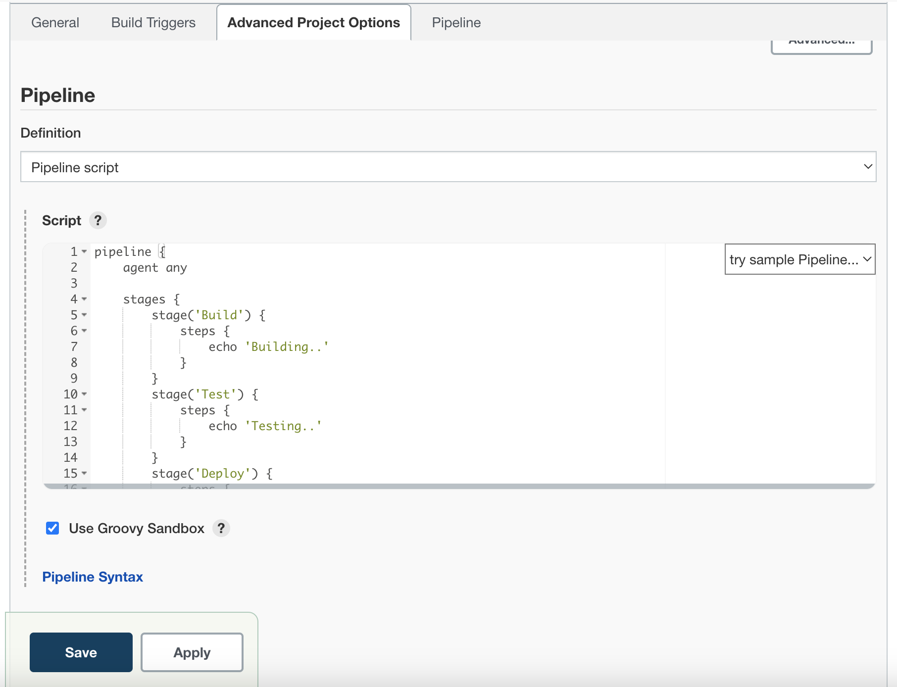
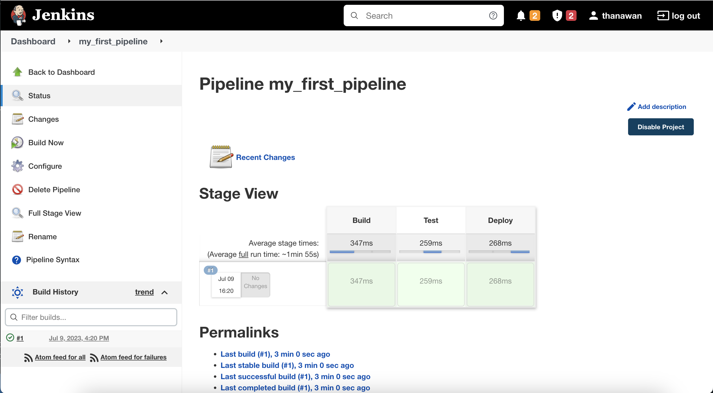

## Creating Jenkins Pipeline

### Click "New Item" (Menu on the left)
- Add pipeline name and select "pipeline" then click OK

- Add some basic pipeline script in pipeline section and save
```sh
pipeline {
    agent any

    stages {
        stage('Build') {
            steps {
                echo 'Building..'
            }
        }
        stage('Test') {
            steps {
                echo 'Testing..'
            }
        }
        stage('Deploy') {
            steps {
                echo 'Deploying....'
            }
        }
    }
}
```

- Click "Build now" to run the pipeline


