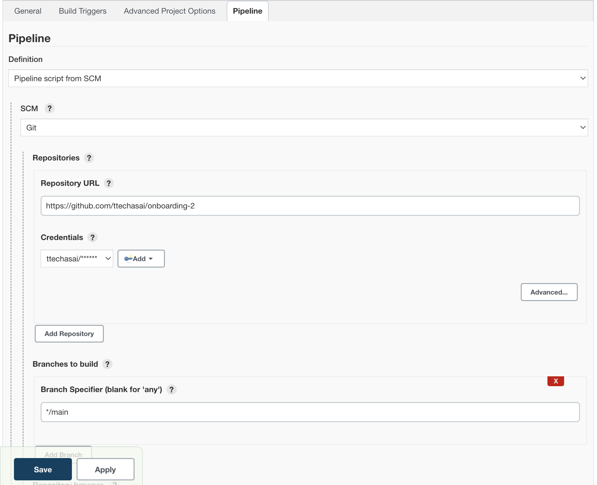
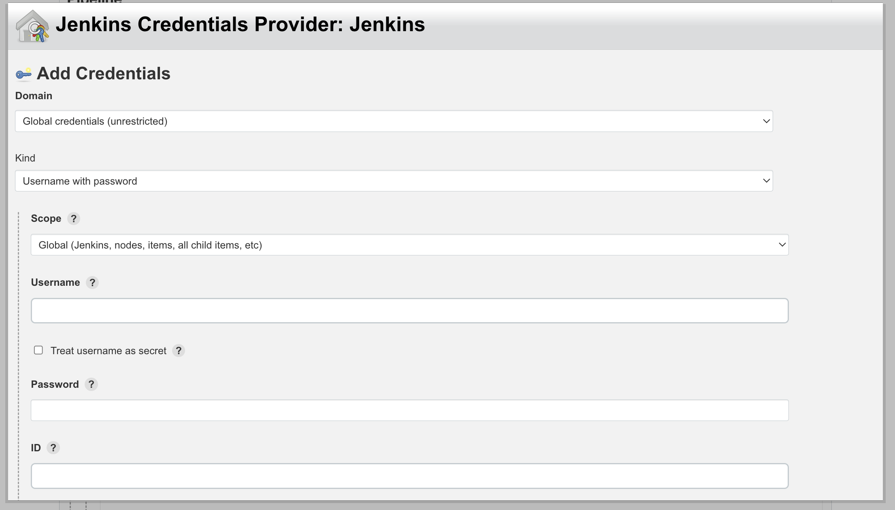

## Jenkinsfile

## update your pipeline to use Jenkinsfile 

### Prerequisites
- Generate Github token and save your token somewhere you will use it later. follow this document: https://docs.github.com/en/authentication/keeping-your-account-and-data-secure/creating-a-personal-access-token

### Update Pipeline Config
1. Click Configure
2. In Pipeline Section
- Definition: choose "Pipeline script from SCM" option. This optioninstructs Jenkins to obtain your Pipeline from Source Control Management (SCM), whichwill be your locally cloned Git repository. 
- SCM: choose "Git".​
- Repository URL: <b>\<your github repository link></b> (example: https://github.com/palo-it-th/hive-devops-dojos)
- Branch: <b> */main</b>

- In credentials section click add to add new credential
- Kind: "Username with password" 
- Scope: Global (Jenkins, noded, items, all child items, etc)
- Username: <b>\<your github username></b>
- PasswordL: <b>\<your github token></b>

- Select your Credentials that you added previously​
- Script Path: <b> onboarding-2/Jenkinsfile​</b> (path to your jenkinsfile)
- save