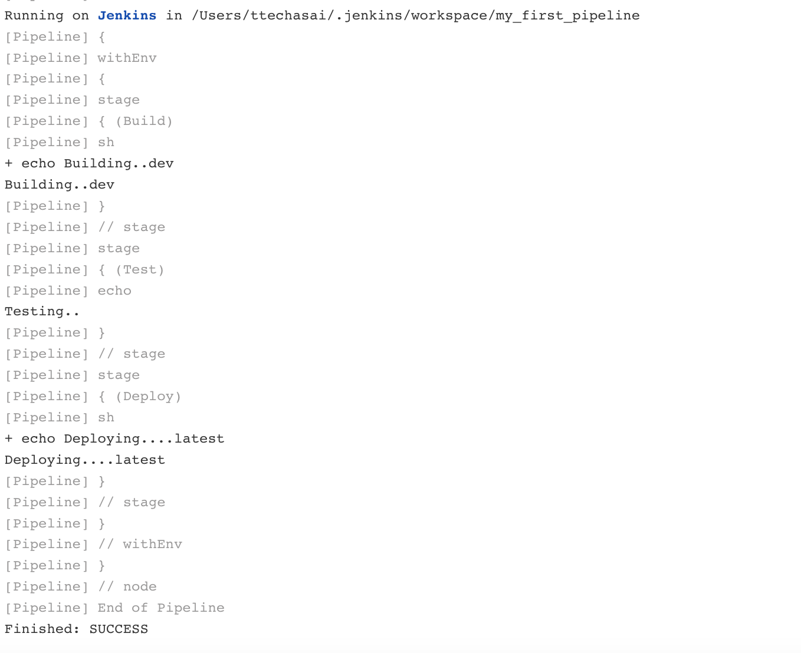

## Jenkins Parameter and Environment Variables

### Update your jenkinfile by adding environment and parameters

```Jenkins
pipeline {
    agent any

    environment {
        E2E_MODE = "ci"
        DEV = "dev"
        ALPHA = "alpha"
        PREPROD = "preprod"
    }

    parameters {
        string(name: 'VERSION', description: 'The commit target to build.', defaultValue: 'latest')
        booleanParam(name: 'ENABLE_CONTRACT_TEST', description: 'Enable contract testing (will remove this after contract is updated)', defaultValue: false)
        
    }

    stages {
        stage('Build') {
            steps {
                sh """
                echo 'Building..${DEV}'
                """
            }
        }
        stage('Test') {
            steps {
                echo 'Testing..'
            }
        }
        stage('Deploy') {
            steps {
                sh """
                echo 'Deploying....${params.VERSION}'
                """
            }
        }
    }
}
```
### to use jenkins environment and parameters 
- ENV
```sh
steps {
    sh """
    echo 'Building..${DEV}'
    """
}
```
- Parameter
```sh
steps {
    sh """
    echo 'Deploying....${params.VERSION}'
    """
}
```

- commit your update and click build now to run new jenkinsfile
- now you should see menu "Build with Parameters"
- click  "Build with Parameters" and click "Build" to run the pipeline with parameters
- then you should see env and paramerter value print in console log

